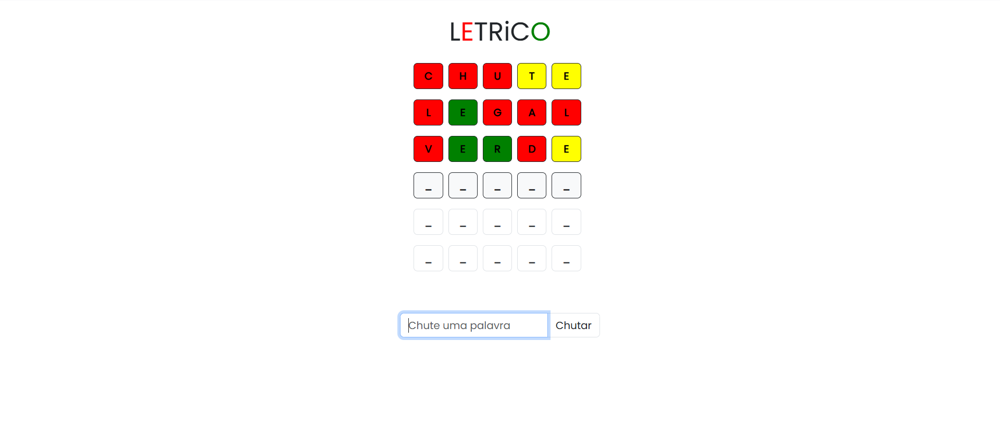

# 🎯 Letrico


**A Portuguese word puzzle game inspired by Wordle, and mainly its Brazilian version, Letreco**

[](https://portfolio-website-adrian-lobato.onrender.com/projects/letrico)
[](https://developer.mozilla.org/en-US/docs/Web/HTML)
[](https://developer.mozilla.org/en-US/docs/Web/CSS)
[](https://developer.mozilla.org/en-US/docs/Web/JavaScript)
[](https://getbootstrap.com/)

[🎮 Play Now](https://portfolio-website-adrian-lobato.onrender.com/projects/letrico) • [📝 Report Bug](https://github.com/adrian1715/letrico/issues) • [✨ Request Feature](https://github.com/adrian1715/letrico/issues)

---

## 📖 About The Project

**Letrico** is an interactive word puzzle game built with **vanilla JavaScript**, inspired by the popular game "Wordle" - or "Letreco" in Brazil. Players have 6 attempts to guess a 5-letter Portuguese word, with visual feedback provided after each guess to help narrow down the possibilities.

### 🎮 How It Works

- 🔤 **Guess the Word:** Enter a valid 5-letter Portuguese word
- 🟩 **Green:** Letter is correct and in the right position
- 🟨 **Yellow:** Letter is in the word but in the wrong position
- ⬜ **Gray:** Letter is not in the word
- 🎯 **6 Attempts:** You have six chances to guess the correct word

### 🌟 Key Features

- ✅ **Pure Vanilla JavaScript** - No frameworks or libraries (except Bootstrap for UI)
- 🎨 **Beautiful UI** - Clean, responsive design with smooth animations
- 🇧🇷 **Portuguese Words** - Extensive dictionary of Brazilian Portuguese words
- 📊 **Visual Feedback** - Intuitive color-coded hints
- 📱 **Fully Responsive** - Works seamlessly on mobile and desktop
- ⚡ **Fast Performance** - Lightweight and optimized for speed
- 🎯 **Simple Gameplay** - Easy to learn, challenging to master

---

## 🚀 Live Demo

**[Play Letrico Now →](https://portfolio-website-adrian-lobato.onrender.com/projects/letrico)**



Try to guess today's word! Challenge your friends and see who can solve it in fewer attempts.

---

## 🛠️ Built With

- **HTML5** - Semantic markup structure
- **CSS3** - Custom styling and animations
- **JavaScript (ES6+)** - Game logic and interactivity
- **Bootstrap 5** - Responsive UI framework

---

## 💻 Getting Started

### Prerequisites

- A modern web browser (Chrome, Firefox, Safari, Edge)
- No additional installations required!

### Installation

1. **Clone the repository**

   ```bash
   git clone https://github.com/adrian1715/letrico.git
   cd letrico
   ```

2. **Open in browser**

   Simply open `index.html` in your web browser:

   ```bash
   # On macOS
   open index.html

   # On Linux
   xdg-open index.html

   # On Windows
   start index.html
   ```

3. **Or use a local server** (optional)

   ```bash
   # Using Python 3
   python -m http.server 8000

   # Using Node.js http-server
   npx http-server
   ```

   Then navigate to `http://localhost:8000`

---

## 📁 Project Structure

```
letrico/
├── index.html          # Main HTML structure
├── style.css          # Custom styles
├── app.js             # Game logic and functionality
├── words.js           # Portuguese word dictionary
└── README.md          # Documentation (English)
└── README-ptbr.md     # Documentation (Portuguese)
```

---

## 🎯 How to Play

1. **Start the Game**

   - Open the game in your browser
   - The game automatically selects a random 5-letter word

2. **Make Your Guess**

   - Type a valid 5-letter Portuguese word in the input field
   - Click "Chutar" (Guess) or press Enter

3. **Check the Feedback**

   - 🟩 **Green tiles** - Correct letter in correct position
   - 🟨 **Yellow tiles** - Correct letter in wrong position
   - ⬜ **Gray tiles** - Letter not in the word

4. **Win or Lose**
   - Guess the word correctly within 6 attempts to win!
   - If you run out of attempts, the correct word will be revealed

### Example Gameplay

```
Attempt 1: CARRO
Result: C🟨 A⬜ R🟩 R⬜ O⬜

Attempt 2: VERDE
Result: V⬜ E🟨 R🟩 D⬜ E🟨

Attempt 3: CERVO
Result: C🟩 E🟩 R🟩 V🟩 O🟩
✅ You Win!
```

---

## 🎨 Features in Detail

### Game Mechanics

- **Word Validation:** Checks if entered word is valid Portuguese
- **Color-Coded Feedback:** Visual hints after each guess
- **Attempt Counter:** Tracks remaining guesses
- **Game State Management:** Win/lose conditions and game reset

### User Interface

- **Responsive Grid:** 6 rows × 5 columns for guesses
- **Interactive Keyboard:** Click or type to play
- **Smooth Animations:** Tile flips and color transitions
- **Clean Design:** Minimalist interface inspired by modern word games

### Technical Highlights

- **No External Dependencies** (except Bootstrap for UI)
- **Clean Code Architecture:** Modular and maintainable
- **Performance Optimized:** Fast load times and smooth gameplay
- **Cross-Browser Compatible:** Works on all modern browsers

---

## 🔧 Code Overview

### Main Files

**`app.js`** - Core game logic

```javascript
// Key functions include:
- Word selection from dictionary
- Input validation and processing
- Color-coding logic for letter feedback
- Win/lose condition checking
- Game state management
```

**`words.js`** - Word database

```javascript
// Contains:
- Array of valid 5-letter Portuguese words
- Used for both answer selection and input validation
```

**`index.html`** - Game interface

```html
<!-- Structure includes:
- Game title and header
- 6×5 grid for guesses
- Input field and submit button
- Win/lose message display
-->
```

---

## 🌐 Browser Compatibility

| Browser | Supported Version |
| ------- | ----------------- |
| Chrome  | ✅ 90+            |
| Firefox | ✅ 88+            |
| Safari  | ✅ 14+            |
| Edge    | ✅ 90+            |
| Opera   | ✅ 76+            |

---

## 📱 Responsive Design

Letrico is fully responsive and works perfectly on:

- 📱 **Mobile Phones** (320px+)
- 📱 **Tablets** (768px+)
- 💻 **Laptops** (1024px+)
- 🖥️ **Desktops** (1440px+)

---

## 🎓 What I Learned

Building Letrico helped me improve my skills in:

- ✅ **DOM Manipulation:** Dynamic content updates and event handling
- ✅ **Game Logic:** State management and rule implementation
- ✅ **CSS Animations:** Smooth transitions and visual effects
- ✅ **Responsive Design:** Mobile-first approach
- ✅ **User Experience:** Intuitive interface design
- ✅ **Vanilla JavaScript:** Building complex features without frameworks

---

## 🤝 Contributing

Contributions are welcome! If you have suggestions or improvements:

1. Fork the project
2. Create your feature branch (`git checkout -b feature/AmazingFeature`)
3. Commit your changes (`git commit -m 'Add some AmazingFeature'`)
4. Push to the branch (`git push origin feature/AmazingFeature`)
5. Open a Pull Request

---

## 📝 License

This project is open source and available under the [MIT License](LICENSE).

---

## 👨‍💻 Author

**Adrian Lobato**

- GitHub: [@adrian1715](https://github.com/adrian1715)
- LinkedIn: [Adrian Lobato](https://linkedin.com/in/adrian-lobato)
- Portfolio: [portfolio-website-adrian-lobato.onrender.com](https://portfolio-website-adrian-lobato.onrender.com/)

---

## 🙏 Acknowledgments

- Inspired by [Wordle](https://www.nytimes.com/games/wordle/index.html) by Josh Wardle
- Built with ❤️ for Portuguese speakers
- Special thanks to the Brazilian Portuguese word list contributors

---

## 📊 Project Stats


---

**If you like this project, please consider giving it a ⭐**

_I truly appreciate your support!_

[⬆ Back to Top](#-letrico)
